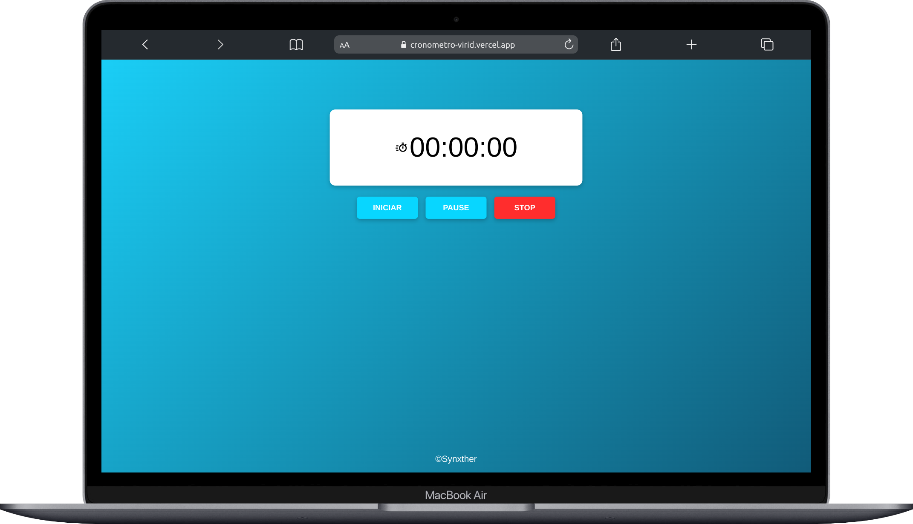
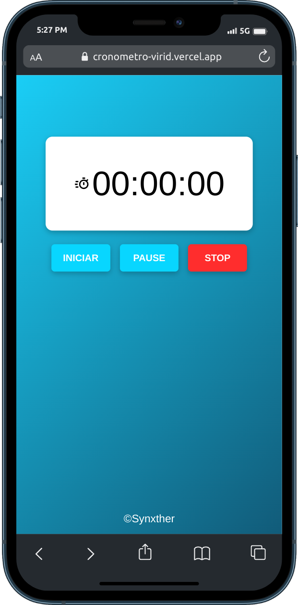

# Cronometro in JS

- this project is created by HTML, CSS and JavaScript
- works for mobile devices and web browsers
- its layout is clean and simples for used

#

# Layout
### Desktop and mobile version:

  
  

# Link:
<a href="https://cronometro-virid.vercel.app/">GO TO SITE</a>
